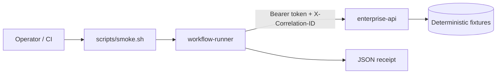

# Architecture

## Components

| Service | Role | Ports |
|---|---|---|
| `enterprise-api` | Mock authenticated enterprise operations API | `8080` |
| `workflow-runner` | Integration seam that retrieves incident + runbook and emits a proposed action plan | on-demand container |

## Threat boundary

- **In scope:** local fixture token (`lab-read-token`), deterministic incident data, structured logs, correlation IDs, failure injection for operator drills.
- **Out of scope:** real customer identity providers, production secrets, external mutation, Hermes model/provider credentials.
- **Secrets:** `.env` is gitignored. Compose injects fixture values at runtime. Receipts and logs must not echo tokens.

## Identity model (M1/M2)

The API accepts a single scoped bearer token with read-only access to incident and runbook endpoints. Invalid or missing tokens return `401`/`403`. The workflow runner never stores the token in receipts.

## Correlation and observability

`X-Correlation-ID` is accepted on inbound API requests or generated when absent. The same value is returned on responses and propagated through workflow dependency call records.

Structured JSON logs on the API include `service`, `path`, `status`, `correlation_id`, and `elapsed_ms`.

## Failure injection

For operator drills and contract tests:

| Trigger | Effect |
|---|---|
| `?inject=error` or `X-Inject-Failure: error` | Returns HTTP 500 |
| `?inject=timeout` or `X-Inject-Failure: timeout` | Sleeps `INJECT_TIMEOUT_SECONDS` then continues |

## Limitations

This repository is a **customer-shaped lab**, not a production customer deployment and **not** the Hermes Agent container itself. M3 will add the Hermes plugin/MCP boundary; M4 adds metrics and broader failure scripts.
