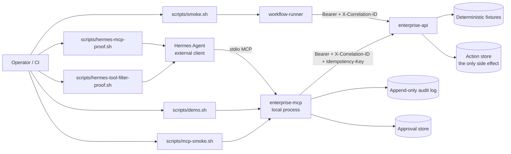

# Architecture

## Components



| Component | Role | Runtime |
|---|---|---|
| `enterprise-api` | Mock authenticated enterprise operations API, read + write scopes | Compose container (`8080`) or local uvicorn |
| `workflow-runner` | Integration seam: retrieval, planning, approval gate, idempotent execution | Compose on-demand container / imported library |
| `enterprise-mcp` | FastMCP stdio server; tool surface chosen by an allowlist | Local process (no port) |
| **Hermes Agent** | External operator that discovers MCP tools via isolated `HERMES_HOME` | **Not** a Compose service |

## Proof layers

| Layer | Command | What it proves | What it does not |
|---|---|---|---|
| Full arc | `./scripts/demo.sh` | Scoped discovery, approval stop, forced failure, resume, exactly-once, audit | No model is involved; the caller is the script |
| FastMCP protocol | `./scripts/mcp-smoke.sh` | Tool list/inspect/call **with real credential injection**, plus a wrong-token negative control | Not a Hermes-side proof |
| Hermes discovery | `./scripts/hermes-mcp-proof.sh` | The real `hermes` CLI connects over stdio and lists the tools | No invocation, no LLM |
| Hermes scoping | `./scripts/hermes-tool-filter-proof.sh` | Hermes discovers 4 tools vs 1 depending on the server allowlist | Not Hermes's own `tools.include` enforcement |
| Workflow seam | `./scripts/smoke.sh` | Containerized workflow-runner produces an approval-gated receipt | Read/plan path only |
| Fresh clone | `./scripts/fresh-clone-check.sh` | A clean clone of HEAD installs and passes everything | Not a CI run |

## MCP tool surface

| Tool | Mutating | Behavior |
|---|---|---|
| `check_enterprise_api` | no | Health/readiness probe; reports whether a write credential is present; never returns a token |
| `get_incident_context` | no | Incident + runbook retrieval with per-dependency correlation IDs |
| `propose_incident_plan` | no | Plan receipt; consequential steps carry `approval_required` and a stable `action_id` |
| `apply_incident_plan` | **yes** | Approval-gated idempotent execution of one runbook step |

The surface is chosen by `ENTERPRISE_MCP_ENABLED_TOOLS` and applied **before**
registration, so an excluded tool is absent from `list_tools` and not callable.
The default is read/plan only.

Hermes prefixes MCP tool names as `mcp__<server>__<tool>` for the model-facing
toolset, but `hermes mcp test` prints bare names. Receipts here record the bare
names as observed and flag the prefixed form as asserted, not observed.

## Threat boundary

- **In scope:** two local fixture token scopes via environment, deterministic
  incident data, structured logs, correlation IDs, an in-lab mutation target,
  failure injection for operator drills.
- **Out of scope:** real customer identity providers, production secrets,
  external mutation, Hermes model/provider credentials.
- **Secrets:** `.env` is gitignored. The Hermes MCP config references
  `${ENTERPRISE_API_TOKEN}` and forwards it explicitly through its `env:` block —
  MCP stdio does not inherit the parent environment. Receipts, tool output, and
  logs must not echo tokens; tests assert this.

## Identity model

Two static bearer scopes:

| Token | Grants |
|---|---|
| `ENTERPRISE_API_TOKEN` (read) | `GET` incident, runbook, applied-action list |
| `ENTERPRISE_API_WRITE_TOKEN` (write) | `POST` an incident action; superset of read |

Missing credentials return `401`, wrong scope returns `403`. The MCP server has
**no default token** and exits 2 without one.

## Approval semantics

Enforced at runtime, not merely represented in a receipt.

```
apply_incident_plan(incident, action)                -> pending_approval, token minted, NO write sent
apply_incident_plan(incident, action, bad_token)     -> approval_rejected, NO write sent
apply_incident_plan(incident, other_action, token)   -> approval_rejected, NO write sent
apply_incident_plan(incident, action, valid_token)   -> write dispatched
```

The human step is supplying the token out of band. Tests assert "no write was
sent" against observed HTTP traffic rather than the response's own claim.

Boundary: this is a workflow-layer control. It is not a Hermes policy control and
not an API-side authorization rule.

## Idempotency and resume

The idempotency key is minted **with the approval**, not with the attempt, so a
resume reuses it automatically.

| Situation | Result |
|---|---|
| First approved call | `applied`, `replayed: false`, one record created |
| Same key again | `replayed: true`, original record returned, no new record |
| Failure after commit, then resume | `error` with resume instructions, then `replayed: true`; store count stays 1 |

## Failure injection

| Trigger | Effect |
|---|---|
| `?inject=error` / `X-Inject-Failure: error` | HTTP 500 **before** any commit |
| `?inject=error_after_commit` | Commits the record, **then** HTTP 500 — the case a naive retry double-applies |
| `?inject=timeout` | Sleeps `INJECT_TIMEOUT_SECONDS` then continues |

The MCP server reads its fault switch from `ENTERPRISE_INJECT_FAILURE`, so faults
are configuration rather than a tool argument an agent could set.

## Correlation, audit, and observability

- **Run-level** `correlation_id` on every tool payload and receipt; updated when
  the API returns `X-Correlation-ID`.
- **Per-dependency** `correlation_id` on each `dependency_calls[]` entry.
- **Append-only audit log** (`.audit/*.jsonl`), one JSON object per line, with
  `run_id`, `seq`, `event`, `actor`, `correlation_id`. Events: `run_started`,
  `tool_invoked`, `approval_requested`, `approval_granted`, `approval_rejected`,
  `mutation_attempted`, `mutation_committed`, `mutation_replayed`,
  `mutation_failed`, `run_finished`.
- Structured JSON logs on the API include `service`, `path`, `status`,
  `correlation_id`, and `elapsed_ms`.

## Limitations

A customer-shaped lab, not a customer deployment. The approval and audit stores
are local files sized for a single operator. No model has chosen or invoked any
of these tools.
