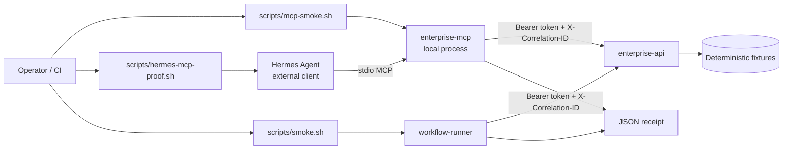

# Architecture

## Components

| Component | Role | Runtime |
|---|---|---|
| `enterprise-api` | Mock authenticated enterprise operations API | Compose container (`8080`) |
| `workflow-runner` | Integration seam: incident + runbook retrieval, proposed action plan | Compose on-demand container |
| `enterprise-mcp` | FastMCP stdio server with three read/plan tools | Local process (no port) |
| **Hermes Agent** | External operator that discovers MCP tools via isolated `HERMES_HOME` | **Not** a Compose service |

## Proof layers (M3)

| Layer | Command | What it proves |
|---|---|---|
| FastMCP protocol | `./scripts/mcp-smoke.sh` (or `MCP_SMOKE_PROTOCOL_ONLY=1` in CI) | Tool list, inspect, and direct `fastmcp call` for all three tools |
| Hermes discovery | `./scripts/hermes-mcp-proof.sh` | `hermes mcp test enterprise_ops` lists prefixed tools in isolated `HERMES_HOME` |
| Workflow seam | `./scripts/smoke.sh` | Containerized workflow-runner produces approval-gated receipt |

Hermes discovery does **not** invoke tools through an LLM. Invocation at the Hermes layer is deferred; FastMCP protocol calls are the honest invocation proof.

## MCP tool surface (M3)

| Tool | Behavior |
|---|---|
| `check_enterprise_api` | Health/readiness probe; returns base URL, status, correlation ID; never returns token |
| `get_incident_context` | Incident + runbook retrieval with per-dependency correlation IDs |
| `propose_incident_plan` | Planner receipt with `approval_required: true` for consequential runbook steps |

Hermes registers tools as `mcp__enterprise_ops__<tool_name>`.

## Threat boundary

- **In scope:** local fixture token via environment, deterministic incident data, structured logs, correlation IDs, failure injection for operator drills.
- **Out of scope:** real customer identity providers, production secrets, external mutation, Hermes model/provider credentials.
- **Secrets:** `.env` is gitignored. Hermes MCP config references `${ENTERPRISE_API_TOKEN}`; the launcher and operator shell supply the value. Receipts, MCP tool output, and logs must not echo tokens.

## Identity model (M1/M2)

The API accepts a single scoped bearer token with read-only access to incident and runbook endpoints. Invalid or missing tokens return `401`/`403`. The workflow runner and MCP server never store the token in receipts or tool responses.

## Correlation and observability

- **Run-level** `correlation_id`: propagated on the MCP tool payload or workflow receipt; updated when the API returns `X-Correlation-ID`.
- **Per-dependency** `correlation_id`: each `dependency_calls[]` entry preserves its own correlation ID without overwriting sibling entries.

Structured JSON logs on the API include `service`, `path`, `status`, `correlation_id`, and `elapsed_ms`.

## Approval semantics

`approval_required: true` on plan receipts and consequential `proposed_actions` **represents** that human approval would be needed before executing those steps. All three MCP tools are read/plan-only; this lab does **not** enforce a runtime human-approval gate or execute mutations.

## Failure injection

For operator drills and contract tests:

| Trigger | Effect |
|---|---|
| `?inject=error` or `X-Inject-Failure: error` | Returns HTTP 500 |
| `?inject=timeout` or `X-Inject-Failure: timeout` | Sleeps `INJECT_TIMEOUT_SECONDS` then continues |

## Limitations

This repository is a **customer-shaped lab**, not a production customer deployment. M4 adds metrics and broader failure scripts spanning API, MCP, and receipts.
