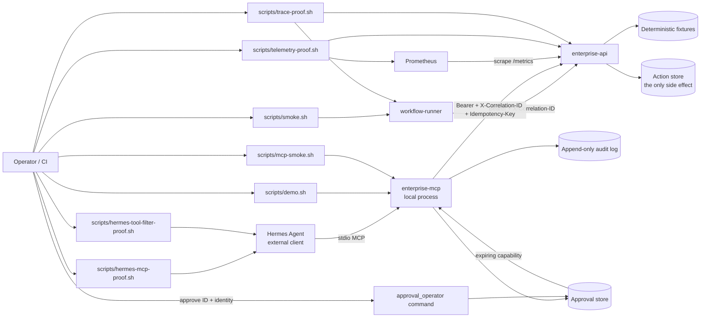

# Architecture

## Components



| Component | Role | Runtime |
|---|---|---|
| `enterprise-api` | Mock authenticated enterprise operations API, read + write scopes | Compose container (`8080`, loopback-published on configurable host port) or local uvicorn |
| `workflow-runner` | Integration seam: retrieval, planning, approval gate, idempotent execution | Compose on-demand container / imported library |
| `enterprise-mcp` | FastMCP stdio server; tool surface chosen by an allowlist | Local process (no port) |
| **Hermes Agent** | External operator that discovers MCP tools via isolated `HERMES_HOME` | **Not** a Compose service |
| `prometheus` | Scrapes bounded-cardinality API metrics and evaluates five alert rules | Pinned Compose container or repository-pinned plus upstream-manifest-checked temporary native process |
| OpenTelemetry (opt-in) | W3C CLIENT/SERVER spans plus bounded approval events, exported over loopback OTLP/HTTP | Disabled unless `OTEL_TRACES_EXPORTER=otlp` and a loopback endpoint are set |

## What each check covers

| Check | Command | Covers | Does not cover |
|---|---|---|---|
| Full arc | `./scripts/demo.sh` | Scoped discovery, caller/operator separation, forced failure, resume, terminal capability, exactly-once, audit | No model is involved; the script automates the operator command with a fixture identity |
| FastMCP protocol | `./scripts/mcp-smoke.sh` | Tool list/inspect/call **with real credential injection**, plus a wrong-token negative control | Not a Hermes-side proof |
| Hermes discovery | `./scripts/hermes-mcp-proof.sh` | The real `hermes` CLI connects over stdio and lists the tools | No invocation, no LLM |
| Hermes scoping | `./scripts/hermes-tool-filter-proof.sh` | Hermes discovers 4 tools vs 1 depending on the server allowlist | Not Hermes's own `tools.include` enforcement |
| Workflow seam | `./scripts/smoke.sh` | Containerized workflow-runner produces a guarded receipt | Read/plan path only |
| Native telemetry | `./scripts/telemetry-proof.sh` | Prometheus selected by repository-pinned Linux amd64/arm64 digest, with `actual == repository_pin == upstream_manifest` required before extraction; live target/scrape/query, five loaded alerts, positive firing fixtures, and idle-series negative controls | No containers, Alertmanager delivery, or production traffic |
| Native traces | `./scripts/trace-proof.sh` | Loopback OTLP/HTTP capture with direct causality: an API SERVER span must share the workflow CLIENT trace ID **and** have `parent_span_id == client.span_id`; bounded failure/resume events and a secret allowlist | No collector backend, retention, production traffic, or customer data |
| Container proof (script/CI contract) | `bash ./scripts/container-proof.sh` | **Contract:** isolated Compose project, loopback-only free host ports, API volume store, negative auth, post-commit failure, restart persistence, replay, telemetry, and demo. **Attested only when** `.container-proof/receipt.json` exists from a successful local run or a successful CI `container-proof` job — the script alone is not runtime evidence | Not K8s, OIDC, cloud deploy, or model invocation; absence of a receipt means the runtime claim is unattested |
| Fresh clone | `./scripts/fresh-clone-check.sh` | A clean clone of HEAD installs, passes `pytest`, and passes `scripts/demo.sh`; GitHub Actions runs this as a separate job | It does **not** re-run native telemetry, trace, Hermes, smoke, or container checks |

## MCP tool surface

| Tool | Mutating | Behavior |
|---|---|---|
| `check_enterprise_api` | no | Health/readiness probe; reports whether a write credential is present; never returns a token |
| `get_incident_context` | no | Incident + runbook retrieval with per-dependency correlation IDs |
| `propose_incident_plan` | no | Plan receipt; consequential steps carry `approval_required` and a stable `action_id` |
| `apply_incident_plan` | **yes** | Requests approval or consumes a separately granted capability to execute one runbook step idempotently |

The surface is chosen by `ENTERPRISE_MCP_ENABLED_TOOLS` and applied **before**
registration, so an excluded tool is absent from `list_tools` and not callable.
The default is read/plan only.

Hermes prefixes MCP tool names as `mcp__<server>__<tool>` in the model-facing
toolset, but `hermes mcp test` prints bare names. Local receipts therefore store
the bare names printed by the CLI and label the prefixed form as expected rather
than observed.

## Security model

- **In scope:** two local fixture token scopes via environment, deterministic
  incident data, structured logs, correlation IDs, an in-lab mutation target,
  failure injection for operator drills.
- **Out of scope:** real customer identity providers, production secrets,
  external mutation, Hermes model/provider credentials.
- **Secrets:** `.env` is gitignored. The Hermes MCP config references
  `${ENTERPRISE_API_TOKEN}` and forwards it explicitly through its `env:` block —
  MCP stdio does not inherit the parent environment. Receipts, tool output, and
  logs must not echo tokens; tests assert this.

## Identity model

Two static bearer scopes:

| Token | Grants |
|---|---|
| `ENTERPRISE_API_TOKEN` (read) | `GET` incident, runbook, applied-action list |
| `ENTERPRISE_API_WRITE_TOKEN` (write) | `POST` an incident action; superset of read |

Missing credentials return `401`, wrong scope returns `403`. The MCP server has
**no default token** and exits 2 without one.

## Write approval

The write gate is executable code, not a flag in a response:

```
apply_incident_plan(incident, action)                  -> pending_approval + opaque ID, NO write
approval_operator approve <ID> --approver <identity>  -> expiring capability, identity recorded
apply_incident_plan(incident, action, bad_capability) -> approval_rejected, NO write
apply_incident_plan(incident, other, capability)      -> approval_rejected, NO write
apply_incident_plan(incident, action, capability)     -> write dispatched once
apply_incident_plan(incident, action, applied_cap)    -> approval_rejected, NO write
```

The MCP caller can request approval but cannot grant it.
The request response exposes only an opaque `approval_id`, never the capability
or idempotency key. A distinct operator command records the supplied approver
identity and yields a capability once; only its SHA-256 hash is stored. Validation
requires `approved` state, exact incident/action binding, and an unexpired grant.
`applied` and `expired` are terminal. Tests assert "no write was sent" against
observed HTTP traffic rather than the response's own claim.

The lab does not authenticate the identity string
passed to `--approver`, protect the local JSON store from another local writer,
or provide a production policy service. The demo automates both caller and
operator roles for reproducibility, while exercising them through different
surfaces and processes. This proves structural separation, not human judgment.

This is a workflow-runner control. It is neither a Hermes policy nor an API-side
authorization rule.

State machine:

```text
pending ──operator approve──> approved ──confirmed apply/replay──> applied
   │                            │
   └──────────── TTL ───────────┴────────────────────────────────> expired
```

An ambiguous failure does not transition `approved` to `applied`, because the
caller does not yet know whether the upstream committed. The same capability may
retry with the same idempotency key. If the upstream reports a replay, the
approval becomes `applied`; any further use is refused before dispatch.

## Idempotency and resume

The idempotency key is minted **with the approval**, not with the attempt, so a
resume reuses it automatically.

| Situation | Result |
|---|---|
| First approved call | `applied`, `replayed: false`, one record created |
| Same capability after a confirmed apply | `approval_rejected`, no request dispatched |
| Failure after commit, then resume | `error` with resume instructions, then `replayed: true`; store count stays 1 |

## Failure injection

| Trigger | Effect |
|---|---|
| `?inject=error` / `X-Inject-Failure: error` | HTTP 500 **before** any commit |
| `?inject=error_after_commit` | Commits the record, **then** HTTP 500 — the case a naive retry double-applies |
| `?inject=timeout` | Sleeps `INJECT_TIMEOUT_SECONDS` then continues |

The MCP server reads its fault switch from `ENTERPRISE_INJECT_FAILURE`, so faults
are configuration rather than a tool argument an agent could set.

## Logs and correlation IDs

- Caller-provided `X-Correlation-ID` values are accepted only as canonical UUID
  strings at API and workflow-runner trust boundaries. Anything else is replaced
  with a newly generated UUID and is not reflected into headers, logs, traces,
  audit records, or durable stores. W3C `traceparent` stays separate.
- **Run-level** `correlation_id` on every tool payload and receipt; updated when
  the API returns a normalized `X-Correlation-ID`.
- **Per-dependency** `correlation_id` on each `dependency_calls[]` entry.
- **Append-only audit log** (`.audit/*.jsonl`), one JSON object per line, with
  `run_id`, `seq`, `event`, `actor`, `correlation_id`. Events: `run_started`,
  `tool_invoked`, `approval_requested`, `approval_granted`, `approval_rejected`,
  `mutation_attempted`, `mutation_committed`, `mutation_replayed`,
  `mutation_failed`, `run_finished`.
- Structured JSON logs on the API include `service`, route template, `status`,
  `correlation_id`, `elapsed_ms`, and when tracing is on, `trace_id` and
  `span_id`. Secret-bearing headers are not logged.

## Metrics, SLOs, and alerts

The API exposes an intentionally unauthenticated Prometheus text endpoint at
`/metrics` so the configured scraper does not need an application bearer token.
Compose publishes the API only on loopback in this lab; a real shared network
would need an authenticated or network-restricted metrics boundary. Request
counters and latency histograms use HTTP method, route **template**, and status
class labels; incident IDs are deliberately excluded. Mutation outcomes
distinguish `created`, `replayed`, and `postcommit_error`.

Prometheus evaluates 99% availability and 95%-under-500-ms latency objectives
with fast (1h/5m) and slow (6h/30m) multi-window burn alerts. A separate
zero-delay alert identifies ambiguous post-commit failures so the operator can
resume with the same capability and idempotency key. `promtool` fixtures prove
all five alerts can fire and that idle latency series do not consume the error
budget. The repository does not configure Alertmanager or claim notification
delivery.

## Tracing

Tracing is opt-in. `OTEL_TRACES_EXPORTER=otlp` plus a loopback OTLP/HTTP
endpoint enable it; any other combination leaves a no-op tracer. The workflow
runner injects W3C `traceparent` on CLIENT spans. API middleware extracts that
context and starts SERVER spans named with the HTTP method and route template.
`workflow-runner` wraps `apply_incident_action` in an INTERNAL span with enum
events only:
`approval.requested`, `approval.accepted`, `mutation.dispatched`,
`mutation.failed_resumable`, `mutation.applied`, `mutation.replayed`,
`approval.rejected`.

The attribute allowlist is `http.method`, `http.route`, `http.status_class`,
`elapsed_ms`, `correlation_id`, and enum `reason` values. Bearer tokens,
approval capabilities, idempotency keys, notes, bodies, and incident or action
identifiers are dropped. `./scripts/trace-proof.sh` is sampled local capture,
not a collector or retention system. See [slo.md](slo.md).

## Limitations

A local lab is not a customer deployment. The approval and action stores are
single-host JSON files with a separate `<path>.lock` and Linux `fcntl.flock`
around load-modify-replace. That demonstrates multi-process safety on one host;
it is not a distributed datastore.

Every tool call in this repository comes from a script or test. A model-driven
run would require provider spend, which I declined on 2026-08-01. A real Hermes
build does connect over stdio and enumerate the tools
(`scripts/hermes-mcp-proof.sh`, `scripts/hermes-tool-filter-proof.sh`), but it
does not choose or call them.

The operator identity is a caller-supplied fixture string, not an authenticated
principal. The approval store is a local JSON file with single-host file locking;
it is not a production authorization service, though it stores only the
capability hash.

The audit log is append-only by convention — a plain `.jsonl` file with no
signature or chain hash. It is not tamper-evident, `run_started` and
`run_finished` carry a null correlation ID, and the enterprise API writes no
audit of its own, so a direct write to the API leaves no trace in it.

The telemetry path is a single Prometheus process over synthetic traffic. It is
not external paging, long-term production retention, or multi-host
observability. Native proof and Compose proof remain separate claims. The
trace path is loopback OTLP/HTTP capture with `SimpleSpanProcessor`; it is not
a collector backend.

Container-proof coverage above is the script/CI **contract**. The evidence
boundary for a runtime pass is `.container-proof/receipt.json` from a successful
local `container-proof.sh` run or a successful CI job that uploaded one. Until
that receipt exists, treat the Compose restart/replay path as implemented but
unattested on this host.
